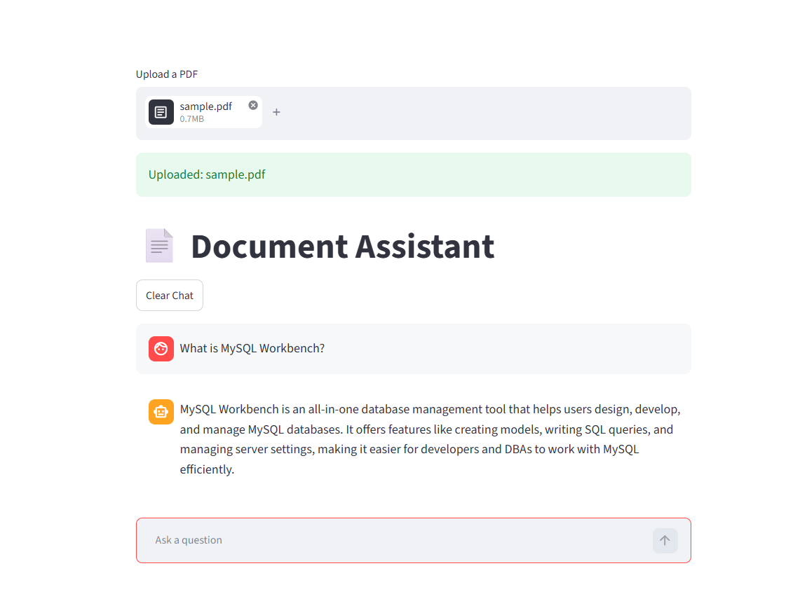
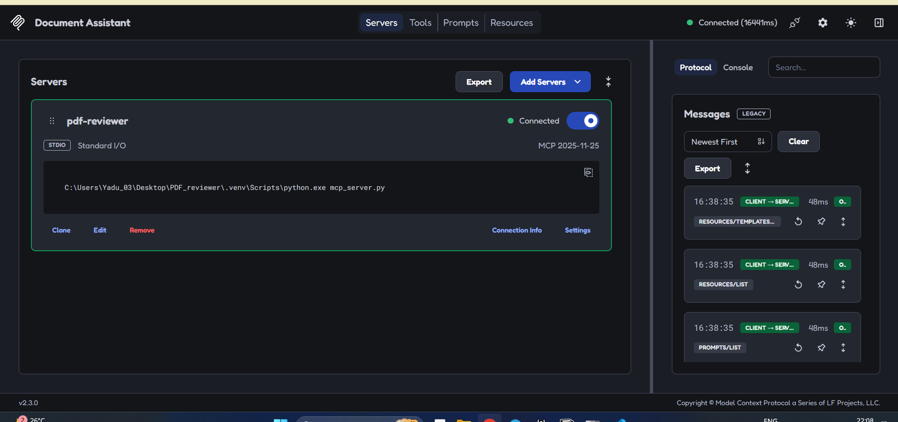
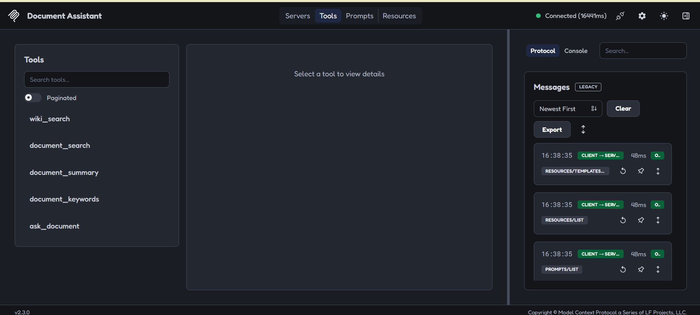

\# AI Document Assistant

An AI-powered Document Assistant built using **RAG (Retrieval-Augmented Generation)**, **FAISS**, **MCP (Model Context Protocol)**, **Ollama**, and **Streamlit**.

Upload PDF documents, ask questions about their content, generate summaries, extract keywords, and answer general knowledge questions using Wikipedia integration.

---

## Features

### Document Question Answering
- Ask questions about uploaded PDF documents.
- Retrieves relevant document chunks using FAISS vector search.
- Generates natural language answers using Ollama.

### Document Summarization
- Generate concise summaries of uploaded documents.

### Keyword Extraction
- Extract important keywords and topics from documents.

### General Knowledge Questions
- Wikipedia integration for questions outside the uploaded document.

### MCP Integration
- Exposes tools through MCP.
- Allows tool discovery and execution through MCP clients.

### PDF Upload Support
- Upload PDF files directly from the Streamlit interface.
- Automatically creates embeddings and indexes documents for retrieval.

### Streamlit Interface
- Simple and user-friendly chat interface.
- Upload PDFs and interact with documents in real time.

---

## Screenshots

### Streamlit Interface



### MCP Server Connection



### MCP Tools



---

## Architecture

```text
PDF
 │
 ▼
PDF Loader
 │
 ▼
Text Chunking
 │
 ▼
Embeddings
 │
 ▼
FAISS Vector Store
 │
 ▼
Retrieval
 │
 ▼
LLM (Ollama)
 │
 ▼
Answer Generation
```

---

## Tech Stack

### Backend
- Python

### LLM
- Ollama
- Qwen 2.5 Coder 7B

### Vector Database
- FAISS

### Embeddings
- Sentence Transformers

### Protocol
- MCP (Model Context Protocol)

### Frontend
- Streamlit

### External Knowledge
- Wikipedia API

---

## Project Structure

```text
AI-Document-Assistant/
│
├── datas/
│
├── screenshots/
│   ├── streamlit-ui.png
│   ├── mcp-server.png
│   └── mcp-tools.png
│
├── src/
│   ├── pdf_loader.py
│   ├── chunker.py
│   ├── embeddings.py
│   ├── vector_store.py
│   └── rag_store.py
│
├── tools/
│   ├── search_tool.py
│   ├── summary_tool.py
│   ├── keyword_tool.py
│   ├── qa_tool.py
│   └── wiki_tool.py
│
├── app.py
├── agent.py
├── build_rag.py
├── mcp_client.py
├── mcp_server.py
├── requirements.txt
├── README.md
└── .gitignore
```

---

## Installation

### Clone Repository

```bash
git clone https://github.com/yourusername/AI-Document-Assistant.git

cd AI-Document-Assistant
```

### Create Virtual Environment

```bash
python -m venv .venv
```

### Activate Environment

Windows:

```bash
.venv\Scripts\activate
```

Linux/macOS:

```bash
source .venv/bin/activate
```

### Install Dependencies

```bash
pip install -r requirements.txt
```

---

## Install Ollama

Download and install Ollama:

https://ollama.com

Pull the model:

```bash
ollama pull qwen2.5-coder:7b
```

Start Ollama:

```bash
ollama serve
```

---

## Run the Application

```bash
streamlit run app.py
```

Open:

```text
http://localhost:8501
```

---

## How It Works

### Document Questions

Example:

```text
What is MySQL Workbench?
```

The assistant:

1. Searches relevant document chunks.
2. Retrieves matching context using FAISS.
3. Sends context to Ollama.
4. Generates a final answer.

---

### General Knowledge Questions

Example:

```text
Who is Elon Musk?
```

The assistant:

1. Detects the question is not document-specific.
2. Uses Wikipedia.
3. Returns a concise answer.

---

## MCP Tools

### document_search
Search relevant document chunks.

### document_summary
Generate document summaries.

### document_keywords
Extract important keywords.

### ask_document
Question answering over uploaded documents.

### wiki_search
General knowledge lookup using Wikipedia.

---

## Future Improvements

- Multi-PDF support
- Chat history memory
- Conversation context
- Source citations
- Hybrid Search (BM25 + Vector Search)
- Persistent Vector Database
- Docker deployment
- Authentication and user management

---

## Author

**Yadu**

---